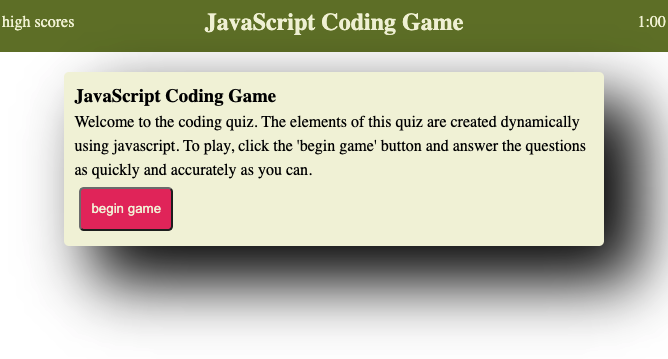

# JavaScript Coding Quiz

<h1 align="center">
JavaScript Coding Quiz
</h1>
    This project challenged me to build a javascript coding quiz. I was inelegantly able to complete the task.
     
    <!-- TABLE OF CONTENTS -->

  
Table of Contents

  <ol>
    <li>
      <a href="#about-the-project">About The Project</a>
    </li>
    <li><a href="#acknowledgements">Acknowledgements</a></li>
  </ol>

<!-- ABOUT THE PROJECT -->
## About The Project

 
This project challenged me to create a JavaScript coding quiz that was created using the DOM. With minimal HTML I was able to generate elements on the page. This was a very fun project that was also extremely useful for the users.

<!-- ACKNOWLEDGEMENTS -->
## Acknowledgements
* Best readme template (https://github.com/othneildrew/Best-README-Template/find/master)

